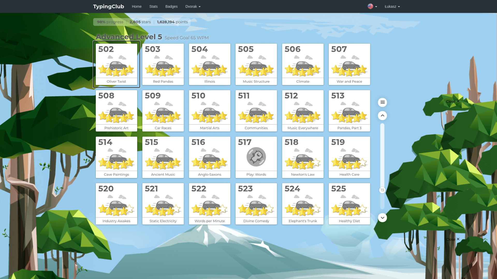
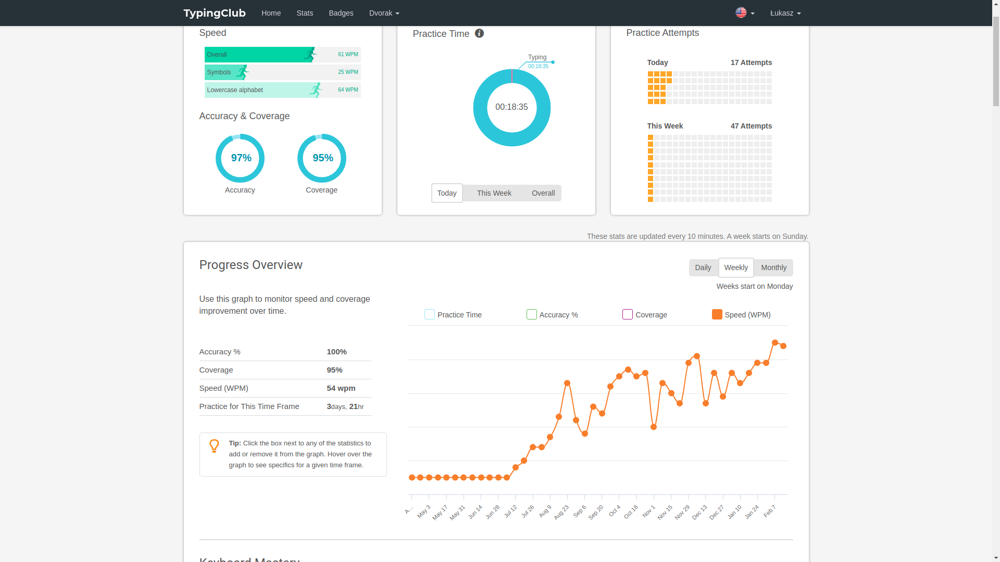

```diff
- For some reason most of tables on git are broken.
```

# Intro
## What is this?
Custom keyboad layout that aims to use 40% of keyboard with (at least) 101% efficiency. Made for VSC 1.57.0 on Ubuntu 20.04.2 LTS.


## Why do I need it?
Learned touch typing and tired of moving right hand fingers form (physcal) `jkl` to &#8592;&#8595;&#8594; constantly? Tired of `QWERTY` layout? That's why!

## What does it do?
Changes `QWERTY` keyboard layout to `STUDIO` (Pic. 1). Cursor movement (arrows), selecting, moving, inserting, copying, scorlling, switching, navigating, resizing with `ijkl` (and vicinity) in `VSC` and `Ubuntu`.

### Core functions
- `STUDIO` keyboard layout (Pic. 1)
- cursor controll (Arrow Keys) with `ijkl` (Pic. 2)
- selecting characters, lines with `ijkl` (Pic. 3)
- Home, End, PageUp, PageDown diagonally to `ijkl` like in numpad  (Pic. 2)
- moving, copying lines with in VSC `ijkl`
- scrolling, moving and switching VSC editors with `ijkl`
- manage Ubuntu's `Workspaces` with `Super` and `ijkl`
- improved `Backspece`
- `numeric block` at right hand on level 5 (Pic. 4)
- most `symbols` at left hand on levels 3 and 5 (Pic. 2, 3, 4)
<!---movement--->

---

```
Keyboard Layout for lvl_1 and lvl_2.
┏━━━━━┱─────┬─────┬─────┬─────┬─────┬─────┬─────┬─────┬─────┬─────┬─────┬─────┲━━━━━━━━━━━┓
┃Esc  ┃     │     │     │     │     │     │     │     │     │     │dead │dead ┃Backspace  ┃
┃     ┃     │     │     │     │     │     │     │     │     │     │symb.│symb.┃           ┃
┣━━━━━┻━┱───┴─┬───┴─┬───┴─┬───┴─┬───┴─┬───┴─┬───┴─┬───┴─┬───┴─┬───┴─┬───┴─┬───┺━┳━━━━━━━━━┫
┃Tab    ┃ Q   │ W   │ F   │ k   │ g   │     │ L   │ U   │ D   │ P   │dead │dead ┃Backspace┃
┃       ┃ q   │ w   │ f   │ K   │ G   │     │ l   │ U   │ d   │ p   │symb.│symb.┃         ┃
┣━━━━━━━┻━┱───┴─┬───┴─┬───┴─┲━━━┷━┱───┴─┬───┴─┲━━━┷━┱───┴─┬───┴─┬───┴─┬───┴─┲━━━┻━━━━━━━━━┫
┃Tab      ┃ Α   │ S   │ T   ┃Space┃Enter│ R   ┃ N   ┃ E   │ O   │ I   │Back ┃Enter        ┃
┃         ┃ a   │ s   │ t   ┃     ┃     │ r   ┃ n   ┃ e   │ o   │ i   │space┃             ┃
┣━━━━━━━━━┻━┱───┴─┬───┴─┬───┺━┯━━━┹─┬───┴─┬───┺━┯━━━┹─┬───┴─┬───┴─┬───┴─┲━━━┻━━━━━━━━━━━━━┫
┃Shift      ┃ Z   │ X   │ c   │ v   │ b   │ h   │ m   │ y   │ j   │Shift┃Shift            ┃
┃           ┃ z   │ x   │ C   │ V   │ B   │ H   │ M   │ Y   │ J   │     ┃                 ┃
┣━━━━━━━┳━━━┻━┳━━━┷━━━┱─┴─────┴─────┴─────┴─────┴─────┴───┲━┷━━━━━┷━━━┳━┻━━━┳━━━━━┳━━━━━━━┫
┃Ctrl   ┃Meta ┃Alt    ┃          ISO_Level5_Shift         ┃ISO_Level3_┃Fn   ┃Ctrl ┃Ctrl   ┃
┃       ┃     ┃       ┃                                   ┃Shift      ┃     ┃     ┃       ┃
┗━━━━━━━┻━━━━━┻━━━━━━━┹───────────────────────────────────┺━━━━━━━━━━━┻━━━━━┻━━━━━┻━━━━━━━┛
Pic. 1
```

---

```
Keyboard Layout for lvl_3.
┏━━━━━┱─────┬─────┬─────┬─────┬─────┬─────┬─────┬─────┬─────┬─────┬─────┬─────┲━━━━━━━━━━━┓
┃Esc  ┃     │     │     │     │     │     │     │     │     │     │dead │dead ┃Backspace  ┃
┃     ┃     │     │     │     │     │     │     │     │     │     │symb.│symb.┃           ┃
┣━━━━━┻━┱───┴─┬───┴─┬───┴─┬───┴─┬───┴─┬───┴─┬───┴─┬───┴─┬───┴─┬───┴─┬───┴─┬───┺━┳━━━━━━━━━┫
┃Tab    ┃     │     │     │     │     │     │Home │ Up  │Page │     │dead │dead ┃Backspace┃
┃       ┃  '  │  "  │  /  │  \  │  |  │     │     │     │ Up  │     │symb.│symb.┃         ┃
┣━━━━━━━┻━┱───┴─┬───┴─┬───┴─┲━━━┷━┱───┴─┬───┴─┲━━━┷━┱───┴─┬───┴─┬───┴─┬───┴─┲━━━┻━━━━━━━━━┫
┃Tab      ┃     │     │     ┃     ┃     │     ┃Left ┃Down │Right│Page │Back ┃Enter        ┃
┃         ┃  =  │  +  │  -  ┃  _  ┃     │     ┃     ┃     │     │Down │space┃             ┃
┣━━━━━━━━━┻━┱───┴─┬───┴─┬───┺━┯━━━┹─┬───┴─┬───┺━┯━━━┹─┬───┴─┬───┴─┬───┴─┲━━━┻━━━━━━━━━━━━━┫
┃Shift      ┃     │     │     │     │     │Home │ End │Down │Page │Shift┃Shift            ┃
┃           ┃  [  │  {  │  (  │  <  │  ~  │     │     │     │Down │     ┃                 ┃
┣━━━━━━━┳━━━┻━┳━━━┷━━━┱─┴─────┴─────┴─────┴─────┴─────┴───┲━┷━━━━━┷━━━┳━┻━━━┳━━━━━┳━━━━━━━┫
┃Ctrl   ┃Meta ┃Alt    ┃          ISO_Level5_Shift         ┃ISO_Level3_┃Fn   ┃Ctrl ┃Ctrl   ┃
┃       ┃     ┃       ┃                                   ┃Shift      ┃     ┃     ┃       ┃
┗━━━━━━━┻━━━━━┻━━━━━━━┹───────────────────────────────────┺━━━━━━━━━━━┻━━━━━┻━━━━━┻━━━━━━━┛
Pic. 2
```
---

```
Keyboard Layout for lvl_4.
┏━━━━━┱─────┬─────┬─────┬─────┬─────┬─────┬─────┬─────┬─────┬─────┬─────┬─────┲━━━━━━━━━━━┓
┃Esc  ┃     │     │     │     │     │     │     │     │     │     │dead │dead ┃Backspace  ┃
┃     ┃     │     │     │     │     │     │     │     │     │     │symb.│symb.┃           ┃
┣━━━━━┻━┱───┴─┬───┴─┬───┴─┬───┴─┬───┴─┬───┴─┬───┴─┬───┴─┬───┴─┬───┴─┬───┴─┬───┺━┳━━━━━━━━━┫
┃Tab    ┃     │     │     │     │     │     │Home │ Up  │Page │     │dead │dead ┃Backspace┃
┃       ┃     │     │     │     │     │     │     │     │ Up  │     │symb.│symb.┃         ┃
┣━━━━━━━┻━┱───┴─┬───┴─┬───┴─┲━━━┷━┱───┴─┬───┴─┲━━━┷━┱───┴─┬───┴─┬───┴─┬───┴─┲━━━┻━━━━━━━━━┫
┃Tab      ┃     │     │     ┃     ┃     │     ┃Left ┃Down │Right│Page │Back ┃Enter        ┃
┃         ┃     │     │     ┃     ┃     │     ┃     ┃     │     │Down │space┃             ┃
┣━━━━━━━━━┻━┱───┴─┬───┴─┬───┺━┯━━━┹─┬───┴─┬───┺━┯━━━┹─┬───┴─┬───┴─┬───┴─┲━━━┻━━━━━━━━━━━━━┫
┃Shift      ┃     │     │     │     │     │Home │ End │Down │Page │Shift┃Shift            ┃
┃           ┃  ]  │  }  │  )  │  >  │  `  │     │     │     │Down │     ┃                 ┃
┣━━━━━━━┳━━━┻━┳━━━┷━━━┱─┴─────┴─────┴─────┴─────┴─────┴───┲━┷━━━━━┷━━━┳━┻━━━┳━━━━━┳━━━━━━━┫
┃Ctrl   ┃Meta ┃Alt    ┃          ISO_Level5_Shift         ┃ISO_Level3_┃Fn   ┃Ctrl ┃Ctrl   ┃
┃       ┃     ┃       ┃                                   ┃Shift      ┃     ┃     ┃       ┃
┗━━━━━━━┻━━━━━┻━━━━━━━┹───────────────────────────────────┺━━━━━━━━━━━┻━━━━━┻━━━━━┻━━━━━━━┛
Pic. 3
```
---

```
Keyboard Layout for lvl_5.
┏━━━━━┱─────┬─────┬─────┬─────┬─────┬─────┬─────┬─────┬─────┬─────┬─────┬─────┲━━━━━━━━━━━┓
┃Esc  ┃     │     │     │     │     │     │     │     │     │     │dead │dead ┃Backspace  ┃
┃     ┃     │     │     │     │     │     │     │     │     │     │symb.│symb.┃           ┃
┣━━━━━┻━┱───┴─┬───┴─┬───┴─┬───┴─┬───┴─┬───┴─┬───┴─┬───┴─┬───┴─┬───┴─┬───┴─┬───┺━┳━━━━━━━━━┫
┃Tab    ┃     │     │     │     │     │     │     │     │     │     │dead │dead ┃Backspace┃
┃       ┃  !  │  @  │  #  │  $  │  %  │     │  7  │  8  │  9  │  0  │symb.│symb.┃         ┃
┣━━━━━━━┻━┱───┴─┬───┴─┬───┴─┲━━━┷━┱───┴─┬───┴─┲━━━┷━┱───┴─┬───┴─┬───┴─┬───┴─┲━━━┻━━━━━━━━━┫
┃Tab      ┃     │     │     ┃     ┃     │     ┃     ┃     │     │     │Back ┃Enter        ┃
┃         ┃  ^  │  &  │  *  ┃  _  ┃     │     ┃  4  ┃  5  │  6  │     │space┃             ┃
┣━━━━━━━━━┻━┱───┴─┬───┴─┬───┺━┯━━━┹─┬───┴─┬───┺━┯━━━┹─┬───┴─┬───┴─┬───┴─┲━━━┻━━━━━━━━━━━━━┫
┃Shift      ┃     │     │     │     │     │     │     │     │     │Shift┃Shift            ┃
┃           ┃  ;  │  :  │  ,  │  .  │  ?  │  0  │  1  │  2  │  3  │     ┃                 ┃
┣━━━━━━━┳━━━┻━┳━━━┷━━━┱─┴─────┴─────┴─────┴─────┴─────┴───┲━┷━━━━━┷━━━┳━┻━━━┳━━━━━┳━━━━━━━┫
┃Ctrl   ┃Meta ┃Alt    ┃          ISO_Level5_Shift         ┃ISO_Level3_┃Fn   ┃Ctrl ┃Ctrl   ┃
┃       ┃     ┃       ┃                                   ┃Shift      ┃     ┃     ┃       ┃
┗━━━━━━━┻━━━━━┻━━━━━━━┹───────────────────────────────────┺━━━━━━━━━━━┻━━━━━┻━━━━━┻━━━━━━━┛
Pic. 4
```

---

```
Keyboard Layout for lvl_6. 
┏━━━━━┱─────┬─────┬─────┬─────┬─────┬─────┬─────┬─────┬─────┬─────┬─────┬─────┲━━━━━━━━━━━┓
┃Esc  ┃     │     │     │     │     │     │     │     │     │     │dead │dead ┃Backspace  ┃
┃     ┃     │     │     │     │     │     │     │     │     │     │symb.│symb.┃           ┃
┣━━━━━┻━┱───┴─┬───┴─┬───┴─┬───┴─┬───┴─┬───┴─┬───┴─┬───┴─┬───┴─┬───┴─┬───┴─┬───┺━┳━━━━━━━━━┫
┃Tab    ┃     │     │     │     │     │     │     │     │     │     │dead │dead ┃Backspace┃
┃       ┃  1  │  2  │  3  │  4  │  5  │  6  │  7  │  8  │  9  │  0  │symb.│symb.┃         ┃
┣━━━━━━━┻━┱───┴─┬───┴─┬───┴─┲━━━┷━┱───┴─┬───┴─┲━━━┷━┱───┴─┬───┴─┬───┴─┬───┴─┲━━━┻━━━━━━━━━┫
┃Tab      ┃     │     │     ┃     ┃     │     ┃     ┃     │     │     │Back ┃Enter        ┃
┃         ┃     │     │     ┃     ┃     │  *  ┃  =  ┃  +  │  -  │  _  │space┃             ┃
┣━━━━━━━━━┻━┱───┴─┬───┴─┬───┺━┯━━━┹─┬───┴─┬───┺━┯━━━┹─┬───┴─┬───┴─┬───┴─┲━━━┻━━━━━━━━━━━━━┫
┃Shift      ┃     │     │     │     │     │     │     │     │     │Shift┃Shift            ┃
┃           ┃     │     │     │     │     │     │  %  │  ,  │  .  │     ┃                 ┃
┣━━━━━━━┳━━━┻━┳━━━┷━━━┱─┴─────┴─────┴─────┴─────┴─────┴───┲━┷━━━━━┷━━━┳━┻━━━┳━━━━━┳━━━━━━━┫
┃Ctrl   ┃Meta ┃Alt    ┃          ISO_Level5_Shift         ┃ISO_Level3_┃Fn   ┃Ctrl ┃Ctrl   ┃
┃       ┃     ┃       ┃                                   ┃Shift      ┃     ┃     ┃       ┃
┗━━━━━━━┻━━━━━┻━━━━━━━┹───────────────────────────────────┺━━━━━━━━━━━┻━━━━━┻━━━━━┻━━━━━━━┛
Pic. 5
```

---

**Modifier levels**
level|lvl_1|lvl_2|lvl_3|lvl_4|lvl_5|lvl_6|lvl_7|lvl_8
-:|:-|:-|:-|:-|:-|:-|:-|:-
modifier|none|shift|lvl_3|shift+lvl_3|lvl_5|shift+lvl_5|lvl_3+lvl_5|shift+lvl_3+lvl_5

```

    // Layout levels
    
    // lvl_1
    // alphabet

    // lvl_2
    // ALPHABET
    
    // lvl_3
    // left hand         right hand
    // '"/\|            |home| up |pgup
    // =+-_             |left|down|right|pgdown
    // [{(<>~       home|end |down|pgdown

    // lvl_4
    // left hand
    //
    //
    // ]})>`

    // lvl_5
    // left hand         right hand
    // !@#$%             7890
    // ^&*_              456
    // ;:,.?            0123

    // lvl_7
    // diacritics + nobreakspace

    // lvl_8
    // DIACRITICS
```
---

<!---switching, moving--->

# Installation 
- copy partial keyboard layout form `symbols/60` to /usr/share/X11/xkb/symbols/
- modify keyboard layout in /usr/share/X11/xkb/symbols/pl with `symbols/pl`; add it after first layout (default partial alphanumeric_keys should be first)
- modify /usr/share/X11/xkb/rules/evdev.xml with `rules/evdev.xml` (add it among other Polish variants)
- modify /usr/share/X11/xkb/rules/base.xml with `rules/base.xml` (like above)
- modify /usr/share/X11/xkb/rules/evdev.lst with `rules/evdev.lst` (like above)
- modify /usr/share/X11/xkb/rules/base.lst with `rules/base.lst` (like above)
- choose `Polish (60)` keyboard layout and restart Ubuntu (VSC detects your current keyboard layout on start-up and then caches this information.)
- add `keybinding.json` to VSC (ctrl+k ctr+s, Open Keyboard Shortcuts)
- install `line-jumper` (in VSC <ctrl+shift+x>) 
- install `dconf` with ubuntu software and apply files from dconf folder
- install `Tweaks` with `sudo apt install gnome-tweak-tool`
- install `Center Editor Window` with VSC's Ctrl+P -> ext install kaiwood.center-editor-window
- Ubuntu, Settings, Region & Language, Manage Installed Languages, Keyboard input method -> XIM (unbinds ctrl+shift+u; unbinding with dconf doesn't work)
<!---copy pl file to xkb folder; add paste update--->


# Keyboard layout
## cursor movement
**move by character/line (arrows)** [xkb]
alt_gr|move cursor
-:|:-
i|up
k|down
j|left
l|right

In most key combinations `alt_gr+,` works as `alt_gr+k`

---

**move by word/10 lines** [vsc]
ctrl+alt_gr|move cursor
-:|:-
i|10 lines up
k|10 lines down
j|word left
l|word right

---

**move to beginning/end of line/page** [xkb]
alt_gr|move cursor
-:|:-
o|page up
. or ;|page down
u or n|beginning of line
m|end of line

---

## select
**select characters/lines** [native]
shift+alt_gr|select
-:|:-
i|line up
k|line down
j|character left
l|character right

---

**select words/10 lines** [vsc]
ctrl+shift+alt_gr|select
-:|:-
i|10 lines up
k|10 lines down
j|word left
l|word right

---

**select lines/screen** [native]
shift+alt_gr|select
-:|:-
o|page up
. or ;|page down
u or n|beggining of line
m|end of line

---

**select line at cursor** [vsc]

ctrl+alt+o

---

## view
**center view at cursor** [Center Editor Window]

ctrl+u

---

## moving/copying line
**move line arrowkey direction by line/tab** [vsc]
alt|move
-:|:-
i|line up
k|line down
j|line left
l|line right

---

## move selected
**move selected** [vsc]
shift+alt|move selected
-:|:-
j|left
l|right

---

## insert cursor
**insert cursor** [vsc]
shift+alt|insert cursor
-:|:-
i|above
k|below

---

**copy line** [vsc]
ctrl+° ctrl+shift+°|-
-:|:-
i|copy Lines Up
k|copy Lines Down

---

## scroll editor
**scroll line/page** [vsc]
ctrl+shift|scroll line
-:|:-
i|scroll Line Up
k|scroll Line Down

ctrl+shift+alt|scroll page
-:|:-
i|scroll PageUp
k|scroll PageDown

---

## switch editor
**switch within goup** [vsc]
ctrl+shift|-
-:|:-
j|previous Editor In Group
l|next Editor in Group

-|-
-:|:-
ctrl+tab|next Editor in Group
ctrl+shift+tab|previous Editor In Group

---

**switch witout goup** [vsc]
ctrl+alt_gr|-
-:|-
o|previous Editor
. or ;|next Editor

---

## switch group
**switch group** [vsc]

ctrl+° ctrl+shift+°|-
-:|-
j|previous Group
l|next Group

---

## switch editor (focus)
**switch within goup** [vsc]
alt+meta|-
-:|:-
m|1st editor In Group
,|2nd editor In Group
.|3rd editor In Group

---

## switch group (focus)
**switch group** [vsc]
ctrl+meta|-
-:|-
m|1st Group
,|2nd Group
.|3rd Group

---

## switch bar (focus)
**switch bar** [vsc]
ctrl+meta|-
-:|-
n|Side Bar
p|Activity Bar

---

## toogle bar
**toogle bar** [vsc]
-|-
-|-
ctrl+b|Side Bar
ctrl+shift+b|Activity Bar

---

## move editor 
**move editor within/without goup** [vsc]
ctrl+shift+alt_gr|-
-:|:-
o|Move Editor Left
. or ;|Move Editor Right

ctrl+° ctrl+alt+°|-
-:|-
j|Move Editor into Previous Group
l|Move Editor into Next Group

---
## navigating
**navigate back/forward without editor** [vsc]
alt|-
-:|:-
u or n|navigate back
m|navigate forward

---

**navigate back/forward within editor** [vsc]
shift+alt|-
-:|:-
u or n|navigate back
m|navigate forward

---

**Center Editor Window** [by Kai Wood]
- ctrl+l

---

## Delete merged with Backapece
**delte characters, words, lines in either direction** [vsc]
bksp|-|shift
-|-:|:-
-|left character|right character
**ctrl** |left word|right word
**alt** | line|word
**ctrl+alt**|all left|all right
---

## diacritics
**polish diacritics** [xkb]
alt_gr+caps_lock|-
-:|:-
a|ą
e|ę
o|ó
l|ł
n|ń
c|ć
s|ś
z|ż
x|ź

---

## minor tweaks
**minor replacements/tweaks**
shortcut|command
-:|:-
ctrl+j ctrl+j|toggle panel
ctrl+k ctrl+shift+i|format document
ctrl+shift+f|select highlights
ctrl+shift+4|terminal.kill
alt_gr+,|down
Caps_Lock|as TAB (in most cases)
Tilde|as ESC (in most cases)

Caps_Lock|Switch
-:|:-
shift+y|On
y|Off


---

## switching workspace
**switch to workspace - set 4 static workspaces in Tweaks** [dconf, Tweaks]
super|super|-
-:|-:|:-
i|switch to workspace 1
k|switch to workspace 2
j|switch to workspace 3
l|switch to workspace 4

---

## moving workspace
**move to workspace** [dconf]
super+shift|super+shift|-
-:|-:|:-
i|move to workspace 1
k|move to workspace 2
j|move to workspace 3
l|move to workspace 4

---

## resizing windows
**resize windows** [dconf]
super+alt|-
-:|:-
i|maximize
k|unmaximize
j|toggle tiled left
l|toggle tiled right

---

# From TypingClub

5 start progress.


Platinum progress.


Wpm progress.

---

# Credits
Łukasz Łodożyński <lodyga@o2.pl>

